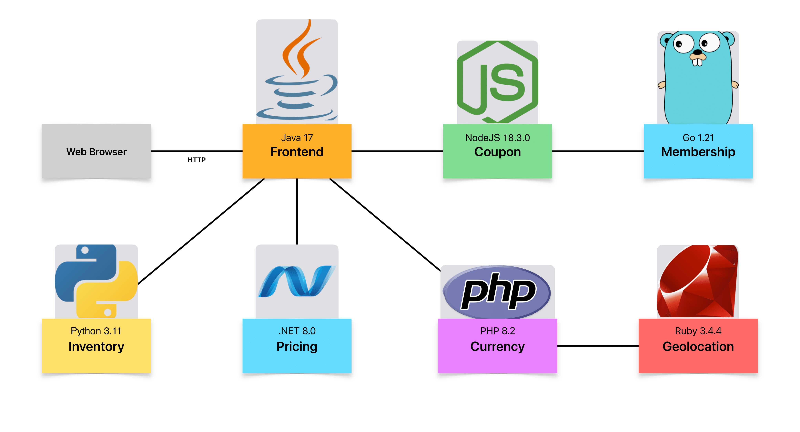

# Simple Demo Applications

This repository contains the code for the Simple Demo Applications.
This application is a simple e-commerce application that allows users to purchase items from a catalog.
This application is used to demonstrate the capabilities of Odigos.

## Architecture



Simple Demo contains the following services:

| Service    | Language   | Version              |
| ---------- | ---------- | -------------------- |
| Coupon     | JavaScript | NodeJS 18.3.0        |
| Currency   | PHP        | 8.2.28 (FPM)         |
| Frontend   | Java       | 17 (Eclipse Temurin) |
| Inventory  | Python     | 3.11                 |
| Membership | Go         | 1.21                 |
| Pricing    | .NET       | 8.0                  |

## Running locally

To build the project and run it locally on a Kind cluster, run the following command:

```bash
make build-images load-to-kind deploy
```
