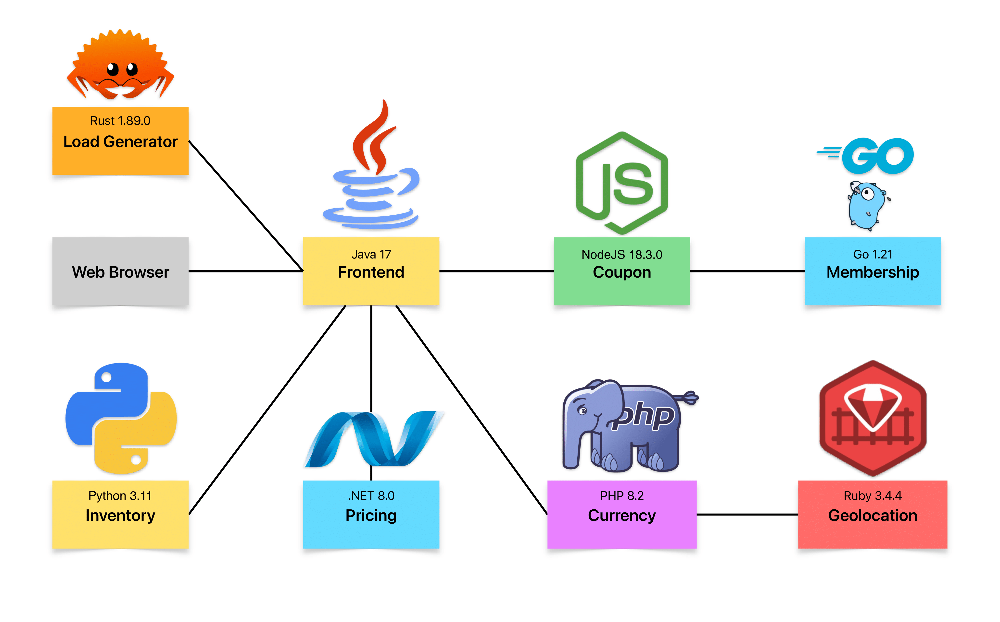

# Simple Demo Applications

This repository contains the code for the Simple Demo Applications.
This application is a simple e-commerce application that allows users to purchase items from a catalog.
This application is used to demonstrate the capabilities of Odigos.

## Architecture



Simple Demo contains the following services:

| Service        | Language        | Version              |
| -------------- | --------------- | -------------------- |
| Load Generator | Rust            | 1.89.0               |
| Coupon         | JavaScript      | NodeJS 18.3.0        |
| Currency       | PHP             | 8.2.28 (FPM)         |
| Frontend       | Java            | 17 (Eclipse Temurin) |
| Geolocation    | Ruby (on Rails) | 3.4.4                |
| Inventory      | Python          | 3.11                 |
| Membership     | Go              | 1.21                 |
| Pricing        | .NET            | 8.0                  |

## Running locally

To build the project and run it locally on a Kind cluster, run the following command:

```bash
make dev-deploy
```

## Installing Simple Demo

Create a Kubernetes cluster, and apply the following manifests:

- simple demo application - `kubectl apply -f https://raw.githubusercontent.com/odigos-io/simple-demo/main/kubernetes/deployment.yaml`
- jaeger - `kubectl apply -f https://raw.githubusercontent.com/odigos-io/simple-demo/main/kubernetes/jaeger.yaml`
- promethues - `kubectl apply -f https://raw.githubusercontent.com/odigos-io/simple-demo/main/kubernetes/promethues.yaml`

After you installed odigos:

- instrument demo apps with odigos - `kubectl apply -f https://raw.githubusercontent.com/odigos-io/simple-demo/main/kubernetes/instrument-all.yaml`
- add jaeger destination to odigos - `kubectl apply -f https://raw.githubusercontent.com/odigos-io/simple-demo/main/kubernetes/jaeger-dest.yaml`
- add promethues destination to odigos - `kubectl apply -f https://raw.githubusercontent.com/odigos-io/simple-demo/main/kubernetes/promethues-dest.yaml`

Do it all in one command:

```bash
kubectl kustomize https://github.com/odigos-io/simple-demo//kubernetes | kubectl apply -f -
```
